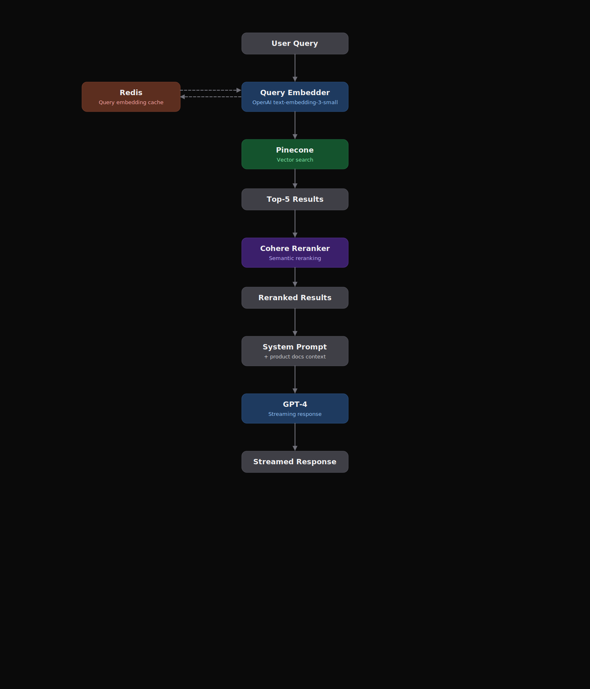

# draw-architecture-svg

A Claude skill for producing polished, dark-themed architecture and flow diagrams as standalone `.svg` files. Opinionated on style — category-coded nodes, rounded boxes, solid/dashed arrows, grouped containers — so every diagram looks consistent with no design decisions required at call time.



## Install

Using the [`skills` CLI](https://github.com/remotion-dev/remotion/tree/main/packages/skills) pattern:

```bash
npx skills add tunayan/draw-architecture-svg https://github.com/tunayan/draw-architecture-svg
```

Or clone directly into your skills directory:

```bash
git clone https://github.com/tunayan/draw-architecture-svg.git ~/.claude/skills/draw-architecture-svg
```

## What it does

Triggers whenever you ask Claude for a system architecture diagram, a RAG/pipeline flowchart, a data-flow diagram, a node-and-edge graph, or a sequence/interaction diagram. Produces a single `.svg` file matching the bundled style system.

## Style system

- **Dark background** (`#0a0a0a`), no gradients or shadows.
- **Six category colors** encoding role, not identity: `neutral`, `compute`, `retrieval`, `rank`, `storage`, `external`.
- **Title + subtitle nodes**: title is what it *is*, subtitle is what it *does here*.
- **Solid arrows** for the primary request flow, **dashed** for side channels (caches, memory, logs).
- **Container groups** with rounded outlines and a label for subsystems.

Full palette, spacing, and typography rules live in `references/style-guide.md`.

## Files

```
draw-architecture-svg/
├── SKILL.md                   # entry point Claude reads
├── references/
│   ├── style-guide.md         # palette, sizes, canvas rules
│   ├── svg-primitives.md      # copy-paste SVG building blocks
│   └── examples.md            # two worked diagrams (RAG + sequence)
├── scripts/
│   └── build_diagram.py       # optional JSON → SVG helper
└── evals/
    └── evals.json             # test prompts
```

## Usage

Once installed, just ask naturally:

> "Draw a diagram of our checkout flow: frontend → API gateway → order service (writes Postgres, publishes Kafka), then a worker consumes Kafka and sends email via SendGrid."

The skill will pick categories, lay out the nodes, route arrows, and save the SVG.

For programmatic use, `scripts/build_diagram.py` takes a JSON spec:

```bash
python scripts/build_diagram.py spec.json -o diagram.svg
```

## License

MIT.
